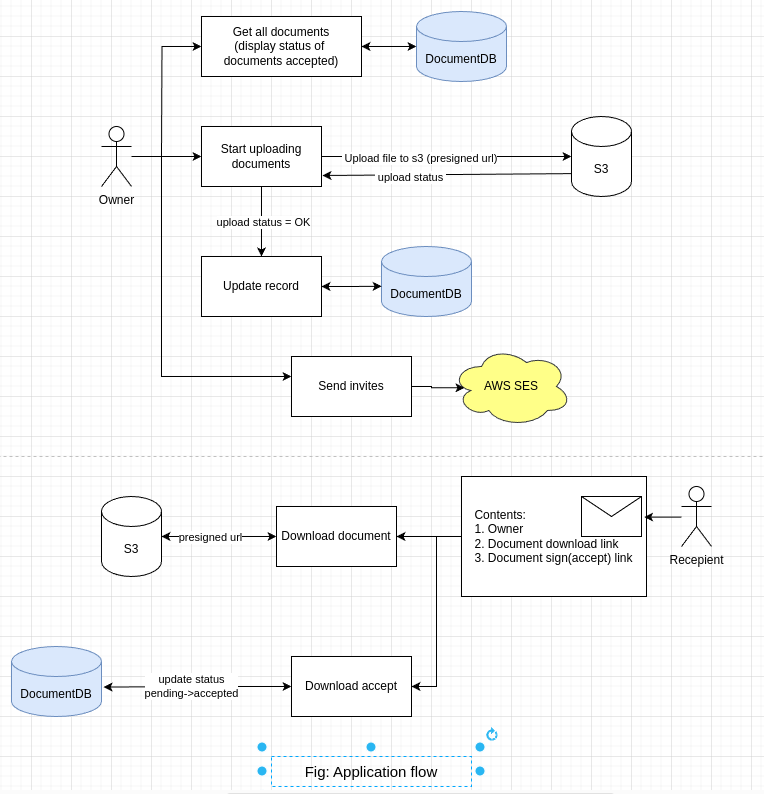
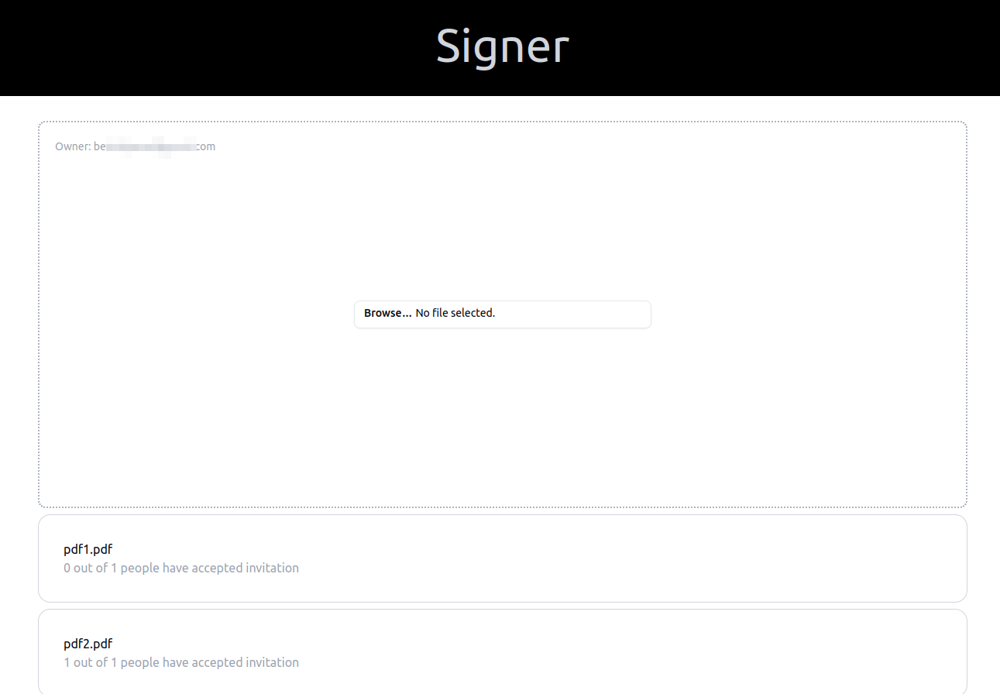

## Brief

E-signatures are a way to digitize a form of contract. A contract is essentially
an agreement and an acceptance to an agreement.

This application demonstrates a simple mechanism to be able to accept an
owner's document that s/he has sent via the recepient's email.

The recepient is able to download the document, and accept the contract
via the links sent to his email

### Technologies used:

- Backend
    - NestJs
- FrontEnd
    - NextJs
- Platform
    - AWS
        - Aws services/configurations used:
            - AWS SES
            - AWS EC2
            - AWS S3
            - AWS Document dbs
            - Elastic IPS, Security Groups, VPCs

## Diagrams and screenshots:

- Basic architecture:

- Application flow:

- Screenshots:

